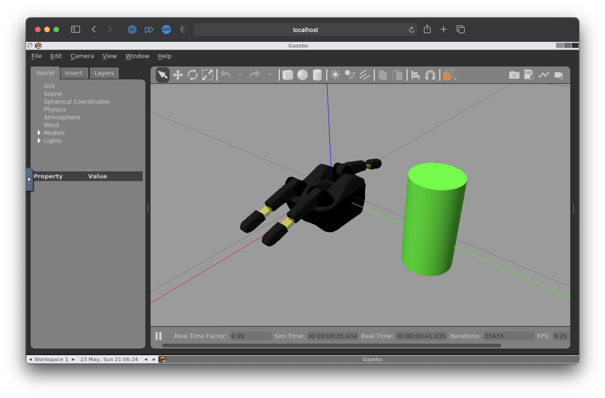

# Reflex Stack

[](https://travis-ci.com/axkoenig/reflex_stack)


## System Architecture 
This repository contains a simulator for Reflex TakkTile robotic hand and the Reflex Interface, an accompanying C++ library. 

**Reflex Simulator**: The idea behind the Reflex simulator is that you swap out the simulator for the real hand without any hassle. To achieve this, the simulator uses the same ROS topics and message definitions as the real hand does. We model some features of the Reflex, such as the tactile sensors and the underactuated distal flexure. 

**Reflex Interface (RI)**: The RI consists of two parts. The *State* module stores the most up to date state information of the Reflex and calculates various useful metrics for grasp analysis (e.g. grasp wrench space, epsilon, grasp matrix, slip prediction, ...). The *Command* module offers high-level control of the robotic hand via ROS services. Further, the RI offers a Keyboard Teleoperation Node for manual control of the robotic hand and the wrist (useful for debugging). The RI will also work on the real hand, although with a reduced feature set (since less information is available).


## Installation

<style> 
summary h3{ display: inline-block; }
</style>

<details>
<summary markdown="block"><h3> Option 1 - Using Docker</h3></summary>

**(1) Clone**: 

Clone this repo along with its submodules. 

```bash 
git clone --recursive git@github.com:axkoenig/reflex_stack.git
cd reflex_stack
```

**(2) Build the Container**: 

If you simply want to try this software out you can directly skip to step (3), which will download the pre-built image from Dockerhub. However, if you want to modify or extend this software you must build it yourself with the included Dockerfile (this may take a while as it builds Gazebo from source ...).

```bash 
docker build -t axkoenig/reflex_stack .
```

**(3) Run the Container** 

Run the container and shell into it to check if everything works. The first command will download the pre-build container from Dockerhub if Docker finds no local container named reflex_stack.
```bash
docker run --name sim -it --rm axkoenig/reflex_stack    # in terminal 1: start simulation container
docker exec -it sim bash -l                             # in terminal 2: shell into container
rostopic echo /reflex_interface/hand_state              # in terminal 2: print out reflex hand state
```

Side-note: If you want to run multiple simulations on one computer just make sure that no ports overlap. You can specifiy the ports like this.  
```bash
# first simulation 
docker run --env ROS_MASTER_URI=http://localhost:11311 --env GAZEBO_MASTER_URI=http://localhost:11321 --name sim_1 -it --rm axkoenig/reflex_stack
# second simulation 
docker run --env ROS_MASTER_URI=http://localhost:11312 --env GAZEBO_MASTER_URI=http://localhost:11322 --name sim_2 -it --rm axkoenig/reflex_stack
```

**(4) Visualize Simulation**

If you want to work with the Gazebo GUI follow these steps and you can view it in your browser. Kill any running containers from step (3). 
```bash
docker-compose up          # in the reflex_stack directory
localhost:8080/vnc.html    # type this in your browser 
```


Note that if you have gzclient installed locally you can follow [this](https://registry.hub.docker.com/_/gazebo) tutorial and check [this](https://www.youtube.com/watch?v=P__phnA57LM) video (which will probably give you a smoother rendering). If you are running the container on Ubuntu check out [this](http://wiki.ros.org/docker/Tutorials/Hardware%20Acceleration) tutorial for hardware acceleration. 

**(5) Interact with Simulation**

If you want to teleoperate the robotic hand you can fire up the keyboard teleoperation node in a separate terminal. 

```bash
docker exec -it sim bash -l
rosrun reflex_interface finger_teleop_node
```

**(6) What next?**

There you have it! But where to go next? If you want to write custom controllers you can write a new ROS node that subscribes to `reflex_takktile/hand_state` and publishes to `reflex_takktile/command_position`. You could also integrate this new node into the Docker network by adding it to the `docker-compose.yml` file.
</details>

<details>
<summary><h3>Option 2 - Using plain Ubuntu</h3></summary>

<summary></summary>

0. Disclaimer: the below steps assume you have a fresh installation of Ubuntu 20.04.
1. Install ROS Noetic by following [these](http://wiki.ros.org/noetic/Installation/Ubuntu) steps.
2. Clone this repository into a new catkin workspace.
```bash 
# Init new catkin workspace
mkdir ~/catkin_ws/src -p
cd ~/catkin_ws/src
catkin_init_workspace
# Clone this repository with its submodules
git clone --recursive https://github.com/axkoenig/reflex_stack.git
```
3. The Reflex Stack was built and tested using Gazebo 11 and DART 6. To run Gazebo with the DART physics engine, you must build Gazebo from source. Running the shell script does this for you. 
```bash 
cd ~/catkin_ws/src/reflex_stack/shell
sudo ./install_gazebo_dart.sh
```
4. Now that you have all the required dependencies you can install the Reflex Stack. 
```bash 
# Build Reflex Stack 
cd ~/catkin_ws
catkin_make
# Source workspace and add to your bashrc
source ~/catkin_ws/devel/setup.bash
echo "source ~/catkin_ws/devel/setup.bash" >> ~/.bashrc
```
5. Check if everything works by firing up the simulation in a new terminal.
```bash 
roslaunch description reflex.launch run_keyboard_teleop_nodes:=true
```
</details>

<details>
<summary><h3>Option 3 - Using Singularity on a Research Cluster</h3></summary>

**Running Reflex Stack on a Research Cluster**

You may want to run the Reflex Stack on a cluster to spawn multiple simulations at once. Most research clusters use Singularity on their systems instead of Docker. You can find an in-depth user guide on Singularity [here](https://sylabs.io/guides/3.7/user-guide/). Luckily, [Singularity is tightly integrated with Docker](https://sylabs.io/guides/3.7/user-guide/singularity_and_docker.html). Hence, the easiest way to run the Reflex Stack through Singularity on a cluster is by using its publicly available Docker image. 

```bash 
# login to your cluster
ssh username@hostname 
# start an interactive slurm session (singularity is usually not available on the login nodes)
salloc -n 1 -c 4 -N 1 --mem 16000 -t 0-04:00 --partition serial_requeue
# run simulation (reflex_stack will be downloaded the first time you run this)
singularity run docker://axkoenig/reflex_stack
```

You should see the simulation running now. If you want to interface with the simulation and run your custom controllers this is my usual workflow. 
```bash 
# (1) start an instance of the simulation 
screen
singularity run docker://axkoenig/reflex_stack
# press Ctrl+a, d on keyboard to detach and leave simulation running
# (2) interface with the simulation
singularity exec docker://axkoenig/reflex_stack bash
source ${CATKIN_WS}/devel/setup.bash
rostopic echo /reflex_takktile/hand_state # you can run your custom ROS code here
```

**Modifying Reflex Stack and run it on a Research Cluster**

You may want to modify the Reflex Stack and run your custom version of it on your cluster. Usually you don't have `sudo` permissions on research clusters, so you'll need to build the image with your modified Reflex Stack on your local machine and then push it to your cluster (`sudo` rights are required to run the `singularity build` command). You have three options: (1) You build a new Docker image from your modified code (like explained above), upload it to Dockerhub and then pull it to the cluster. (2) You locally build a Singularity image from your modified code, upload it to the cluster and run it directly. (3) You can build a Singularity image that only runs ROS and Gazebo (without the Reflex Simulator or RI), push that to the cluster, and once you shell into the image, you can build your modified code with `catkin_make` on the research cluster as usual. Usually options (1) or (2) are fine. I recommend option (3) if you need to update your code frequently, because for option (1) and (2) you will also need to build Gazebo every time which takes a long time.

Here are some instructions for the option (3). 
```bash 
# build your gazebo_ros image on your local machine (this doesn't contain the reflex stack!) 
sudo singularity build gazebo_ros.img gazebo_ros.recipe

# after building your gazebo_ros image, push it to cluster
sudo sftp usename@hostname
put -r gazebo_ros.img

# login to cluster
ssh username@hostname
# start interactive session to get singularity support
salloc -n 1 -c 4 -N 1 --mem 16000 -t 0-04:00 --partition serial_requeue
## A) BUILD REFLEX STACK (YOU ONLY NEED TO DO THIS ONCE)
# create an output directory and shell into our gazebo_ros image 
mkdir output
singularity shell --bind ./output/:/output gazebo_ros.img
# create new catkin workspace
CATKIN_WS=~/catkin_ws
mkdir ${CATKIN_WS}/src -p && cd ${CATKIN_WS}/src
. /opt/ros/noetic/setup.bash && catkin_init_workspace
# clone reflex_stack into src directory 
git clone --recursive https://github.com/axkoenig/reflex_stack.git
# build reflex_stack
cd ${CATKIN_WS} && catkin_make
## B) RUN REFLEX_STACK
source ${CATKIN_WS}/devel/setup.bash
roslaunch description reflex.launch gui:=false
```
</details>

## Keyboard Teleoperation

Below is a list of keys that you can use to teleoperate the robotic hand. You can also use they keyboard teleoperation node on the real hand. Some commands (such as spherical close) are disabled on the real hand as fingers may crash into each other.

| Key | Effect              |
|-----|---------------------|
| u/U | wrist x +/-         |
| i/I | wrist y +/-         |
| o/O | wrist z +/-         |
| j/J | wrist roll +/-      |
| k/K | wrist pitch +/-     |
| l/L | wrist yaw +/-       |
| m   | reset wrist pose    |
| q/Q | finger 1 +/-        |
| w/W | finger 2 +/-        |
| e/E | finger 3 +/-        |
| r/R | preshape +/-        |
| y   | pinch               |
| x   | open                |
| c   | close               |
| v   | spherical open      |
| b   | spherical close     |
| n   | close until contact |
| t   | tighten grasp       |

## Acknowledgements

- The robot description package was initially based on the ```ll4ma_robots_description``` package by the [Utah Learning Lab for Manipulation Autonomy](https://bitbucket.org/robot-learning/ll4ma_robots_description/src/main/).
- The keyboard teleoperation node contains some code for non-blocking keyboard input from [teleop_twist_keyboard.cpp](https://github.com/methylDragon/teleop_twist_keyboard_cpp/blob/master/src/teleop_twist_keyboard.cpp). 